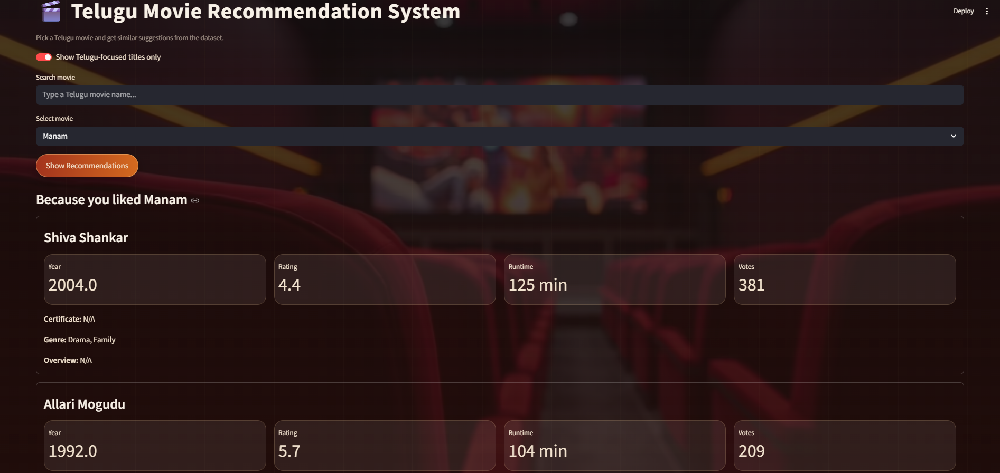

# 🎬 Telugu Movie Recommendation System

🌐 **Live Demo:** https://telugu-movie-recommendation-system.onrender.com

An interactive web application that recommends Telugu movies using machine learning and content-based filtering.

---

## 🚀 Features

* 🔍 Search and select Telugu movies
* 🎯 Get personalized movie recommendations
* 📊 View movie details like rating, runtime, votes, and genre
* 🌐 Clean and interactive UI built using Streamlit

---

## 🧠 Tech Stack

* Python
* Pandas
* NumPy
* Scikit-learn
* Streamlit

---

## ⚙️ How It Works

This system uses **content-based filtering** to recommend movies.

* Extracts features like genre, keywords, and metadata
* Converts text data into numerical vectors
* Computes similarity between movies
* Suggests top similar movies based on user selection

---

## ▶️ Run Locally

```bash
git clone https://github.com/GayathriTutika/telugu-movie-recommendation-system.git
cd telugu-movie-recommendation-system

# Activate virtual environment (Windows)
.venv\Scripts\activate

# Install dependencies
pip install -r requirements.txt

# Run the app
.\.venv\Scripts\python.exe -m streamlit run app.py
```

---

## 📸 Project Preview



---

## 📌 Future Improvements

* 🎥 Add movie posters using API
* 🤖 Improve recommendation accuracy
* ☁️ Enhance deployment and scalability
* ⭐ Add user ratings system

---

## 🎯 Why This Project?

With the growing number of movies available, users often find it difficult to choose what to watch. This project solves that problem by building a personalized recommendation system for Telugu movies.

It demonstrates how machine learning techniques like **content-based filtering** can be applied to real-world scenarios to improve user experience, similar to platforms like Netflix and Amazon.

This project also highlights skills in data processing, similarity modeling, and building interactive web applications using Streamlit.

---

## 🔗 Links

* 🌐 Live Demo: https://telugu-movie-recommendation-system.onrender.com
* 💻 GitHub Repo: https://github.com/GayathriTutika/telugu-movie-recommendation-system

---

## 👨‍💻 Author

**Tutika Gayathri**
